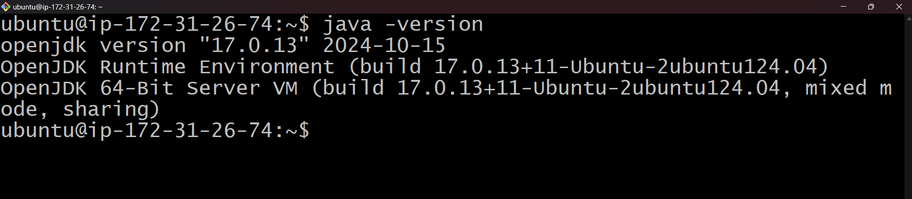

### CI/CD Pipeline for Retail Company on AWS EC2 with Jenkins, Docker, Ansible, Kubernetes, Prometheus, and Grafana

This guide provides a comprehensive setup for creating a CI/CD pipeline using various tools such as Jenkins, Docker, Ansible, Kubernetes, Prometheus, and Grafana, all deployed on an AWS EC2 Ubuntu 24.04 instance.

---

### Prerequisites:
- **AWS EC2 Ubuntu 24.04 instance**
- Access to **GitHub** and **DockerHub**
- Required tools: **Java**, **Maven**, **Git**, **Jenkins**, **Docker**, **Ansible**, **Kubernetes**, **Prometheus**, and **Grafana** pre-installed.

---
# **AWS EC2 Setup Guide**

This guide outlines the steps to set up an AWS EC2 instance with necessary tools for continuous integration and deployment using Jenkins, Docker, Ansible, Kubernetes, Prometheus, and Grafana.

## **1. Setup the AWS EC2 Instance**

### **1.1 Launch an EC2 Instance**
1. **Log in to your AWS account.**
2. **Navigate to the EC2 dashboard and launch a new instance:**
   - **Select the AMI:** Choose **Ubuntu Server 24.04 LTS**.
   - **Select an instance type:** Use `t2.micro` for testing.
   - **Configure security groups:** Allow the following ports:
      - **SSH (port 22)**
      - **HTTP (port 80)**
      - **HTTPS (port 443)**
      - **Jenkins (port 8080)**
      - **Docker (port 2376)**
      - **Grafana (port 3000)**
   - **Add an SSH key pair** for connecting to your instance.

   **Screenshot:** Add a screenshot of the EC2 instance configuration.

   


### **1.2 Connect to the Instance**
- **Open Terminal (Linux/Mac) or Putty (Windows).**
- **Navigate to the directory where your `.pem` file is saved.**
- **Connect using the following command (replace `<key-file>` and `<public-ip>`):**
   ```bash
   chmod 400 <key-file>.pem
   ssh -i <key-file>.pem ubuntu@<public-ip>
   ```

  **Screenshot:** Add a screenshot of the terminal connection process.
  

### **1.3 Update and Upgrade Packages**
```bash
sudo apt-get update && sudo apt-get upgrade -y apt-transport-https ca-certificates curl
```

---

## **2. Install Required Tools**

### **2.1 Install Java**
Jenkins requires Java to run.
```bash
sudo apt install openjdk-11-jdk -y
java -version
```
**Screenshot:** Add a screenshot showing Java installation confirmation.



### **2.2 Install Git**
```bash
sudo apt-get install git -y
git --version
```
**Screenshot:** Add a screenshot showing Git installation confirmation.\


### **2.3 Install Maven**
Maven is used to build Java projects.
```bash
sudo apt install maven -y
mvn -version
```
**Screenshot:** Add a screenshot showing Maven installation confirmation.


### **2.4 Install Docker**
Docker will containerize the application.
```bash
sudo apt-get install docker.io -y
sudo systemctl start docker
sudo systemctl enable docker
docker --version
```
- **Add your user to the Docker group:**
```bash
#sudo groupadd docker
sudo usermod -aG docker $USER
```
- **Log out and re-login** for the group changes to take effect.

**Screenshot:** Add a screenshot showing Docker installation confirmation.\


### **2.5 Install Jenkins**
Jenkins automates builds and deployments.
```bash
# Add Jenkins key and repository
curl -fsSL https://pkg.jenkins.io/debian-stable/jenkins.io-2023.key | sudo tee /usr/share/keyrings/jenkins-keyring.asc > /dev/null
echo deb [signed-by=/usr/share/keyrings/jenkins-keyring.asc] https://pkg.jenkins.io/debian-stable binary/ | sudo tee /etc/apt/sources.list.d/jenkins.list > /dev/null

# Install Jenkins
sudo apt-get update
sudo apt-get install jenkins -y
sudo systemctl start jenkins
sudo systemctl enable jenkins
```
**Permissions and Jenkins Docker Setup:**
```bash
sudo usermod -aG docker jenkins
sudo chmod 666 /var/run/docker.sock
echo "jenkins ALL=(ALL) NOPASSWD: ALL" | sudo tee -a /etc/sudoers > /dev/null
```

- **Visit Jenkins** on `http://<EC2_PUBLIC_IP>:8080`
- **Get the initial password to unlock Jenkins:**
```bash
sudo cat /var/lib/jenkins/secrets/initialAdminPassword
```

**Screenshot:** Add a screenshot of Jenkins setup and initial password retrieval.


### **2.6 Install Ansible**
Ansible will automate the deployment process.
```bash
sudo apt update && sudo apt upgrade -y
sudo apt install software-properties-common -y

# Add Ansible PPA and install Ansible
sudo add-apt-repository ppa:ansible/ansible -y
sudo apt update
sudo apt install ansible -y

# Create Ansible hosts file
mkdir ~/ansible
sudo tee ~/ansible/hosts > /dev/null <<EOL
[localhost]
localhost ansible_connection=local

[k8s]
localhost ansible_connection=local
EOL

# Create Ansible configuration file
sudo tee ~/ansible/ansible.cfg > /dev/null <<EOL
[defaults]
inventory = ./inventory

[privilege_escalation]
become = true
EOL

# Verify Ansible installation
ansible --version

# Install the community.docker collection
ansible-galaxy collection install community.docker kubernetes.core --force

# Install boto3 and botocore (Python libraries for AWS)
sudo apt-get update
sudo apt-get install build-essential libssl-dev libffi-dev python3-dev

sudo apt install python3-pip python3.12-venv -y

# Create a Virtual Environment
sudo -u ubuntu python3 -m venv /home/ubuntu/k8s-ansible-venv
source /home/ubuntu/k8s-ansible-venv/bin/activate

pip3 install boto3 botocore docker dockerpty kubernetes

pip show kubernetes
pip show docker
deactivate

```

**Screenshot:** Add a screenshot showing Ansible installation confirmation.


### **2.7 Add Remote Hosts to Inventory**
Edit the `~/ansible/hosts` file to include your remote servers:
```bash
[webservers]
remote-server-ip ansible_user=ubuntu ansible_ssh_private_key_file=~/.ssh/your-key.pem
```

### **2.8 Install Kubernetes Tools**
Install *kubectl* and *minikube*:
```bash
# Install kubectl
curl -LO "https://dl.k8s.io/release/$(curl -L -s https://dl.k8s.io/release/stable.txt)/bin/linux/amd64/kubectl"
chmod +x kubectl
sudo mv kubectl /usr/local/bin/

# Install minikube
curl -LO https://storage.googleapis.com/minikube/releases/latest/minikube-linux-amd64
chmod +x minikube-linux-amd64
sudo cp minikube-linux-amd64 /usr/local/bin/minikube

# Start minikube
minikube start

# Set permissions for Kubernetes config
chmod -R 777 /home/ubuntu/.kube/config 
chmod -R 777 /home/ubuntu/.minikube/ca.crt
chmod -R 777 /home/ubuntu/.minikube/profiles/minikube/client.crt
chmod -R 777 /home/ubuntu/.minikube/profiles/minikube/client.key

# Set environment path for Kubernetes config
export KUBECONFIG_PATH='/home/ubuntu/.kube/config'
```

**The Jenkins user, ensuring that Jenkins has the necessary permissions and access to the Kubernetes cluster**
```bash
# Set permissions for Kubernetes config
#sudo chown jenkins:jenkins ~/.kube/config
#sudo chmod 600 ~/.kube/config

#Create Kubernetes Directory for Jenkins
sudo mkdir -p /var/lib/jenkins/.kube
sudo cp /home/ubuntu/.kube/config /var/lib/jenkins/.kube/
sudo -u jenkins bash -c "echo 'export KUBECONFIG=var/lib/jenkins/.kube/config' >> ~/.bashrc"
sudo -u jenkins bash -c "source ~/.bashrc"
sudo chown -R jenkins:jenkins /var/lib/jenkins/.kube

# Create the Kubernetes configuration directory if it doesn't exist
sudo mkdir -p /var/lib/jenkins/.minikube/profiles/minikube
sudo cp -r /home/ubuntu/.minikube/profiles/minikube/* /var/lib/jenkins/.minikube/profiles/minikube/
sudo cp /home/ubuntu/.minikube/ca.crt /var/lib/jenkins/.minikube/
sudo chown -R jenkins:jenkins /var/lib/jenkins/.minikube

# Write the Kubernetes config to /var/lib/jenkins/.kube/config
# Use sed to update the specific lines in the config file
sudo sed -i "s|certificate-authority: .*|certificate-authority: /var/lib/jenkins/.minikube/ca.crt|" /var/lib/jenkins/.kube/config
sudo sed -i "s|client-certificate: .*|client-certificate: /var/lib/jenkins/.minikube/profiles/minikube/client.crt|" /var/lib/jenkins/.kube/config
sudo sed -i "s|client-key: .*|client-key: /var/lib/jenkins/.minikube/profiles/minikube/client.key|" /var/lib/jenkins/.kube/config

#Set the KUBECONFIG Environment Variable
#export KUBECONFIG=/home/ubuntu/.kube/config

#View Raw Kubernetes Configuration
#kubectl config view --raw > /tmp/kubeconfig
```

**Check kubectl and minikube Version:**
```bash
$ kubectl version

Client Version: v1.31.1
Kustomize Version: v5.4.2
Server Version: v1.31.0

$ minikube version
minikube version: v1.34.0
commit: 210b148df93a80eb872ecbeb7e35281b3c582c61
```

### **2.9 Install Prometheus & Grafana**

#### **2.9.1 Install Prometheus**
```bash
wget https://github.com/prometheus/prometheus/releases/download/v2.40.3/prometheus-2.40.3.linux-amd64.tar.gz
tar -xvzf prometheus-2.40.3.linux-amd64.tar.gz
cd prometheus-2.40.3.linux-amd64/
./prometheus --config.file=prometheus.yml
```

**Screenshot:** Add a screenshot showing Prometheus installation confirmation.


#### **2.9.2 Install Grafana**
```bash
sudo apt-get install -y software-properties-common
curl https://packages.grafana.com/gpg.key | sudo gpg --dearmor -o /usr/share/keyrings/grafana-archive-keyring.gpg
echo "deb [signed-by=/usr/share/keyrings/grafana-archive-keyring.gpg] https://packages.grafana.com/oss/deb stable main" | sudo tee /etc/apt/sources.list.d/grafana.list
sudo apt-get update
sudo apt-get install grafana -y
sudo systemctl start grafana-server
sudo systemctl enable grafana-server
```

- **Access Grafana at** `http://<EC2_PUBLIC_IP>:3000` (default login: *admin/admin*).

**Screenshot:** Add a screenshot showing Grafana login page.


---

### **3. Build a CI/CD Pipeline**

#### 3.1 Clone the GitHub Repository:
Clone the project repository to your EC2 instance:
```bash
git clone https://github.com/mah-shamim/industry-grade-project-i.git
cd industry-grade-project-i
```

#### 3.2 Create Jenkins Pipeline:
3.2.1. **Login to Jenkins** (`http://<EC2_PUBLIC_IP>:8080`).
3.2.2. Install required plugins:
   - Go to Manage Jenkins > Manage Plugins > Available. and search for
    - Docker Plugin
    - Docker Pipeline Plugin
    - Ansible Plugin
    - Kubernetes Plugin
    - SSH Agent Plugin
    - Restart Jenkins if prompted.
       
3.2.3. **Integrate GitHub with Jenkins**:
   - Add GitHub credentials:
     - Go to Jenkins Dashboard > Manage Jenkins > Manage Credentials.
     - Add a new set of credentials with:
         - Secret Text: Your GitHub Personal Access Key.
         - ID: Recognizable ID like `github`.\
           

   - Create Docker Hub Credentials:
     - Go to Jenkins Dashboard > Manage Jenkins > Manage Credentials.
     - Add a new set of credentials with:
         - Username: Your Docker Hub username.
         - Password: Your Docker Hub password or access token.
         - ID: Recognizable ID like `dockerhub`.\
           

   - Create SSH Agent Credentials:
      - Go to Jenkins Dashboard > Manage Jenkins > Manage Credentials.
      - Add a new set of credentials with:
         - In the Kind dropdown, select "SSH Username with private key".
         - Username: Enter the SSH username that you use to access your Kubernetes master node (e.g., ubuntu, ec2-user, etc.).
         - Private Key: Select "Enter directly".
         - **Private Key Content**: Paste the content of your **private SSH key** (`.pem` or other SSH private key).
           - If you are using a `.pem` file for AWS EC2 instances, open the file in a text editor and copy its content.
           - For example, you can use the following command to view and copy the content of the key:

             ```bash
             cat /path/to/your-key.pem
             ```
         - **ID**: Recognizable ID like `authorized_keys`.
         - **Description**: (Optional) Add a description for the SSH key for easier identification.\
           

#### 3.3 Create a Freestyle Job for Each Task:
- **Compile Job**: Uses Maven to compile the code.
- **Test Job**: Runs tests.
- **Package Job**: Packages the code into a .war file.

#### 3.4 Dockerfile Example:
Example *Dockerfile* to deploy the .war to a Tomcat server:
```dockerfile
FROM iamdevopstrainer/tomcat:base
COPY target/ABCtechnologies-1.0.war /usr/local/tomcat/webapps/
CMD ["catalina.sh", "run"]
```

#### 3.5 Build and Push Docker Image:
```bash
docker build -t mahshamim/abstechnologies:latest .
docker login
docker push mahshamim/abstechnologies:latest
```

Configure Jenkins to build and push Docker images after packaging.

#### 3.6 Write Jenkinsfile:
Here’s a basic *Jenkinsfile* for CI/CD:
```groovy
pipeline {
    agent any
    environment {
        DOCKER_CREDENTIALS_ID = 'dockerhub' // Jenkins ID for DockerHub credentials
        DOCKER_IMAGE = 'mahshamim/abstechnologies'
        DOCKER_REGISTRY = 'https://index.docker.io/v1/' // For DockerHub
        CONTAINER_NAME = "abctechnologies"
        DOCKER_TAG = "${BUILD_ID}"  // Use the BUILD_ID as the tag
        CONTAINER_PORT = "9191"  // Use the BUILD_ID as the tag
    }
    stages {
        stage('Code Checkout') {
            steps {
                git branch: 'master', url: 'https://github.com/mah-shamim/industry-grade-project-i.git'
            }
        }

        stage('Build') {
            steps {
                sh 'mvn clean compile'
            }
        }

        stage('Test') {
            steps {
                sh 'mvn test'
            }
        }

        stage('Package') {
            steps {
                sh 'mvn package'
            }
        }

        stage('Build Docker Image') {
            steps {
                script {
                    docker.build("${DOCKER_IMAGE}:${DOCKER_TAG}")
                }
            }
        }

        stage('Push to DockerHub') {
            steps {
                script {
                    docker.withRegistry("${DOCKER_REGISTRY}", "${DOCKER_CREDENTIALS_ID}") {
                        docker.image("${DOCKER_IMAGE}:${DOCKER_TAG}").push()
                    }
                }
            }
        }
        stage('Stopping and removing existing container...') {
            steps {
                script {
                    def containerExists = sh(
                        script: "docker inspect -f '{{.State.Running}}' ${CONTAINER_NAME}",
                        returnStatus: true
                    )
                    
                    if (containerExists == 0) {
                        echo "Container ${CONTAINER_NAME} exists. Stopping and removing..."
                        sh "docker stop ${CONTAINER_NAME} || true"
                        sh "docker rm ${CONTAINER_NAME}"
                    } else {
                        echo "Container ${CONTAINER_NAME} does not exist. No need to stop or remove."
                    }
                }
            }
        }
        stage('Deploy as container')
		{
			steps
			{
				sh 'docker run -d -p ${CONTAINER_PORT}:8080 --name $CONTAINER_NAME ${DOCKER_IMAGE}:${DOCKER_TAG} || { echo "Failed to start Docker container! Exiting."; exit 1; }'
			}
		}

    }
    post {
        always {
            cleanWs()
        }
    }
}
```
| Pipeline Console                                                  | Pipeline Overview                                                  |
|-------------------------------------------------------------------|--------------------------------------------------------------------|
|  |  |


#### 3.7 Configure Deployment Using Ansible:

Set environment variables: Before running your Ansible playbook, set your Docker Hub credentials as environment variables in your shell:
```bash
export DOCKER_USERNAME='mahshamim' # your dockerhub username
export DOCKER_PASSWORD='01614747054@R!f' # your dockerhub password 

```

Ansible, Docker and Kubernetes Pipeline CI/CD
```groovy
pipeline {
    agent any
    environment {
        DOCKER_CREDENTIALS_ID = 'dockerhub'
        ANSIBLE_PLAYBOOK = 'playbook.yml' // Path to your Ansible playbook
        // Use the full path instead of ~
        KUBECONFIG = '/var/lib/jenkins/.kube/config'
    }
    stages {
        stage('Code Checkout') {
            steps {
                git branch: 'master', url: 'https://github.com/mah-shamim/industry-grade-project-i.git'
            }
        }
        stage('Run Ansible Playbook') {
            steps {
                script {
                    // Use the withCredentials block to inject Docker Hub credentials
                    withCredentials([usernamePassword(credentialsId: DOCKER_CREDENTIALS_ID, passwordVariable: 'DOCKER_PASSWORD', usernameVariable: 'DOCKER_USERNAME')]) {
                        withEnv(['KUBECONFIG_PATH=/var/lib/jenkins/.kube/config']) {
                            sh 'ansible-playbook -i ~/ansible/inventory.ini playbook.yml --become'
                        }
                    }
                }
            }
        }
    }
    post {
        success {
            echo 'Ansible playbook executed successfully!'
        }
        failure {
            echo 'Ansible playbook execution failed.'
        }
    }
}
```
| Pipeline Console                                                                | Pipeline Overview                                                             |
|---------------------------------------------------------------------------------|-------------------------------------------------------------------------------|
|  |  |


Create an Ansible playbook for deployment:
```yaml
- hosts: localhost
  become: yes
  become_method: sudo
  become_user: root
  vars:
     ansible_python_interpreter: /home/ubuntu/k8s-ansible-venv/bin/python
     docker_tag: "latest"  # Change this to any tag you want
     container_name: "abctechnologies-ansible"
     image_name: "mahshamim/abstechnologies-ansible"
     docker_username: "{{ lookup('env', 'DOCKER_USERNAME') }}"
     docker_password: "{{ lookup('env', 'DOCKER_PASSWORD') }}"
     kubeconfig_path: "{{ lookup('env', 'KUBECONFIG_PATH') }}"
     deployment_file: './k8s_deployments/deployment.yml'
     service_file: './k8s_deployments/service.yaml'
     namespace: "abc-technologies-ansible" # Add your desired namespace here
     docker_host: "unix:///var/run/docker.sock"
  tasks:
     - name: Debug kubeconfig path
       debug:
          msg: "Kubeconfig path is {{ kubeconfig_path }}"

     - name: Log in to Docker Hub
       command: echo "{{ docker_password }}" | docker login -u "{{ docker_username }}" --password-stdin

     - name: Use Python from virtual environment
       ansible.builtin.command: /home/ubuntu/k8s-ansible-venv/bin/pip install kubernetes packaging

     - name: Check Python Kubernetes module
       ansible.builtin.command: /home/ubuntu/k8s-ansible-venv/bin/python -c "import kubernetes"

     - name: List installed packages
       ansible.builtin.command: /home/ubuntu/k8s-ansible-venv/bin/pip list

     - name: Check if Docker is already installed
       command: docker --version
       register: docker_installed
       ignore_errors: true

     - name: Install Docker
       apt:
          name: docker.io
          state: present
       when: docker_installed.rc != 0

     - name: Start Docker Service
       service:
          name: docker
          state: started
          enabled: true

     - name: Build WAR file using Maven (if applicable)
       command: mvn clean package
       args:
          chdir: ./
       when: docker_installed.rc == 0  # Run only if Docker is installed

     - name: Build Docker Image
       command: docker build -t {{ image_name }} .

     - name: Stop existing Docker container if running
       docker_container:
          name: "{{ container_name }}"
          state: absent
       ignore_errors: true

     - name: Remove existing Docker container if exists
       docker_container:
          name: "{{ container_name }}"
          state: absent
       ignore_errors: true

     - name: Run Docker Container
       docker_container:
          name: "{{ container_name }}"
          image: "{{ image_name }}"
          state: started
          published_ports:
             - "9292:8080"

     - name: Log in to Docker Hub
       docker_login:
          username: "{{ docker_username }}"
          password: "{{ docker_password }}"

     - name: Tag Docker image for Docker Hub
       command: docker tag {{ image_name }} "{{ image_name }}:{{ docker_tag }}"

     - name: Push Docker image to Docker Hub
       command: docker push "{{ image_name }}:{{ docker_tag }}"

     - name: Ensure Kubernetes namespace exists
       kubernetes.core.k8s:
          name: "{{ namespace }}"
          state: present
          kubeconfig: "{{ kubeconfig_path }}"
          api_version: v1
          kind: Namespace

     - name: Apply Kubernetes Deployment
       kubernetes.core.k8s:
          state: present
          kubeconfig: "{{ kubeconfig_path }}"
          definition: "{{ lookup('file', deployment_file) }}"
          namespace: "{{ namespace }}"  # Specify the namespace here

     - name: Apply Kubernetes Service
       kubernetes.core.k8s:
          state: present
          kubeconfig: "{{ kubeconfig_path }}"
          definition: "{{ lookup('file', service_file) }}"
          namespace: "{{ namespace }}"  # Specify the namespace here
```

**Test the Ansible Playbook:** Run the following command to execute the playbook:
```bash
ansible-playbook path/to/your/playbook.yml
```
OR
```bash
ansible-playbook -i inventory.ini path/to/your/playbook.yml --become
```

**Ansible Playbook Output**
```bash
TASK [Stop existing Docker container if running] *******************************

ok: [localhost]

TASK [Remove existing Docker container if exists] ******************************

ok: [localhost]

TASK [Run Docker Container] ****************************************************

changed: [localhost]

TASK [Log in to Docker Hub] ****************************************************

changed: [localhost]

TASK [Tag Docker image for Docker Hub] *****************************************

changed: [localhost]

TASK [Push Docker image to Docker Hub] *****************************************

changed: [localhost]

TASK [Ensure Kubernetes namespace exists] **************************************

changed: [localhost]

TASK [Apply Kubernetes Deployment] *********************************************

changed: [localhost]

TASK [Apply Kubernetes Service] ************************************************

changed: [localhost]

PLAY RECAP *********************************************************************

localhost                  : ok=19   changed=14   unreachable=0    failed=0    skipped=1    rescued=0    ignored=0
```

**Check Project**
```html
<domain or ip>:<port>/ABCtechnologies-1.0/
```


#### 3.8 Deploy Artifacts to Kubernetes
3.8.1. **Kubernetes Deployment Manifest**:
Create a file named `deployment.yml`:
```yaml
apiVersion: apps/v1
kind: Deployment
metadata:
  name: abstechnologies-deployment
spec:
  replicas: 2
  selector:
    matchLabels:
      app: abstechnologies
  template:
    metadata:
      labels:
        app: abstechnologies
    spec:
      containers:
        - name: abstechnologies
          image: mahshamim/abstechnologies:latest
          ports:
            - containerPort: 8080
```

3.8.2. **Service Manifest**:
Create a file named `service.yaml`:
```yaml
apiVersion: v1
kind: Service
metadata:
  name: abstechnologies-service
spec:
  type: NodePort
  ports:
    - port: 8080
      targetPort: 8080
      nodePort: 30000
  selector:
    app: abstechnologies
```

3.8.3. **Deploy to Kubernetes**:
Run the following commands:
```bash
kubectl apply -f deployment.yml --validate=false
kubectl apply -f service.yaml --validate=false
```

### 3.8.4. *Enable Kubernetes Dashboard*
If you haven't already enabled the Kubernetes dashboard, you need to do so by running the following commands on your EC2 instance:

```bash
minikube addons enable dashboard
minikube addons enable metrics-server
```

### 3.8.5. *Access the Dashboard*
Start the Kubernetes dashboard using:

```bash
minikube dashboard --url
```

This command will start the dashboard and give you a URL to access it. However, the URL will only be accessible from the local environment (EC2 instance) by default.

### 3.8.6. *Port Forwarding to Access Dashboard Remotely*
Since you're using AWS EC2, to access the Kubernetes dashboard from your local machine (laptop or desktop), you need to set up port forwarding. You can use SSH tunneling for that.

From your local machine, run the following command (replace ec2-user with your actual EC2 username and your-ec2-public-ip with your EC2 instance’s public IP address):

```bash
ssh -i /path/to/your-key.pem -L 8001:127.0.0.1:8001 ec2-user@your-ec2-public-ip
```

This will forward traffic from your local port 8001 to the same port on the EC2 instance.

### 3.8.7. *Start the Proxy*
On your EC2 instance, start the kubectl proxy to forward API requests from the browser to the Kubernetes cluster:

```bash
kubectl proxy --port=8001
```

### 3.8.9. *Access the Dashboard from Your Browser*
Now, on your local machine, open the following URL in your web browser:


http://127.0.0.1:8001/api/v1/namespaces/kubernetes-dashboard/services/http:kubernetes-dashboard:/proxy/


This should bring up the Kubernetes dashboard.

### 3.8.10. *Authentication*
The Kubernetes dashboard may ask for an authentication token. To get the token, you can use this command on the EC2 instance:

```bash
kubectl -n kubernetes-dashboard create token admin-user
```

Copy the token and use it for logging into the dashboard.

### 3.8.11. *Kubernetes cluster using an Ansible playbook*


### **4. Set Up Monitoring with Prometheus and Grafana**

#### 4.1 Configure Prometheus
1. **Edit Prometheus Configuration**:
   Open the `prometheus.yml` file and add your service endpoint for monitoring:
   ```yaml
   scrape_configs:
     - job_name: 'kubernetes-services'
       kubernetes_sd_configs:
         - role: endpoints
       relabel_configs:
         - action: labelmap
           regex: __meta_kubernetes_service_label_(.+)
         - source_labels: [__meta_kubernetes_service_name]
           action: replace
           target_label: service
           replacement: $1
   ```

2. **Start Prometheus**:
   Restart Prometheus with the updated configuration. You may want to run it as a Docker container for easier management:
   ```bash
   docker run -d -p 9090:9090 \
       --name prometheus \
       -v $(pwd)/prometheus.yml:/etc/prometheus/prometheus.yml \
       prom/prometheus
   ```
   OR
   ```bash
   /home/ubuntu/prometheus-2.40.3.linux-amd64/prometheus --config.file=prometheus.yml --web.listen-address=":9091"
   ```

#### 4.2 Configure Grafana
1. **Access Grafana**:
   Go to `http://<EC2_PUBLIC_IP>:3000` and log in using the default credentials (`admin/admin`).

2. **Add Prometheus as a Data Source**:
    - Go to Configuration > Data Sources.
    - Click on “Add Data Source”.
    - Select “Prometheus”.
    - Set the URL to `http://<EC2_PUBLIC_IP>:9090`.
    - Click on “Save & Test”.

3. **Create Dashboards**:
    - Create a new dashboard to visualize metrics.
    - Use queries like `rate(http_requests_total[5m])` to view request rates, etc.

4. **Import Docker Dashboard**:
    - Go to Create > Import in Grafana.
    - Use the dashboard ID 893 (a popular cAdvisor and Docker monitoring dashboard) or 1229 (another Docker metrics dashboard) from the Grafana website.
    - Click Load.
    - Select your Prometheus data source and click Import.
    - This will create a dashboard to visualize metrics such as CPU, memory, disk, and network usage for Docker containers.

5. **Import Jenkins Dashboard**:
    - Go to Create > Import in Grafana.
    - Use the dashboard ID 11501 (Jenkins Prometheus Exporter) from the Grafana website.
    - Click Load.
    - Select your Prometheus data source and click Import.
    - This dashboard includes visualizations for Jenkins job metrics, build times, queue lengths, and more.

6. **Here are a few commonly used Grafana Dashboard IDs**:
    - 315: Kubernetes cluster monitoring (via Prometheus)
    - 449: Networking and Load Balancers
    - 741: Kubernetes Deployment metrics
    - 893: Docker and cAdvisor monitoring.
    - 1860: Node Exporter Full for Linux servers.
    - 2583: MySQL overview with Prometheus as the data source.
    - 3831: Kubernetes Cluster Autoscaler (via Prometheus).
    - 6417: Kubernetes Cluster (Prometheus).
    - 7587: Prometheus Blackbox Exporter.
    - 8171: Kubernetes Nodes.
    - 9578: Alertmanager.
    - 9621: Docker Registry.
    - 10701: Nginx monitoring.
    - 10988: Nginx monitoring.
    - 11350: Erlang-Memory-Allocators.
    - 11352: Erlang-Distribution.
    - 11455: K8s / Storage / Volumes / Namespace.
    - 11074: Elasticsearch monitoring.
    - 11501: Jenkins monitoring using Prometheus metrics.
    - 11558: 1 Docker Dashboard for Prometheus 中文版.
    - 12006: Kubernetes apiserver
    - 13041: Website monitoring
    - 13332: kube-state-metrics-v2
    - 13659: Blackbox Exporter (HTTP prober)
    - 13770: 1 Kubernetes All-in-one Cluster Monitoring KR
    - 14584: ArgoCD
    - 14981: CoreDNS
    - 15159: 1 - Cluster & Node - Health & Scaling
    - 15160: 1 - Deployment Performance & Health
    - Visit the Grafana Dashboards Repository for find more.

---

### **5. Final Testing and Verification**

1. **Run the CI/CD Pipeline**:
    - Trigger the pipeline in Jenkins and observe the logs for each stage.
    - Ensure Docker images are built and pushed to DockerHub.
    - Verify Kubernetes deployments and services are correctly set up.

2. **Access Application and Monitoring Tools**:
    - Visit your application at the LoadBalancer's external IP.
    - Check Prometheus at `http://<EC2_PUBLIC_IP>:9090`.
    - Review your Grafana dashboards to ensure metrics are being collected and displayed.

---


### Conclusion
Your CI/CD pipeline is now set up! This configuration allows you to automate your deployment process using Jenkins and Docker, monitor your applications with Prometheus, and visualize performance with Grafana.

Make sure to test your setup thoroughly and modify the configurations as needed to suit your application requirements.

---

Feel free to ask if you have any questions or need further assistance!